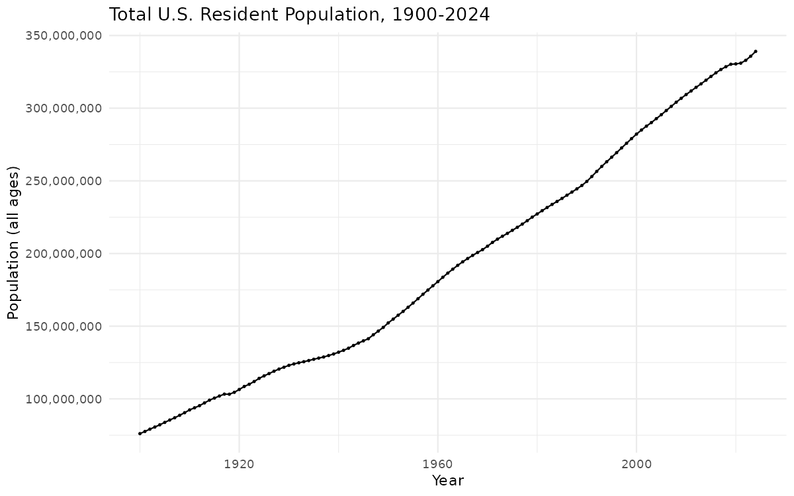
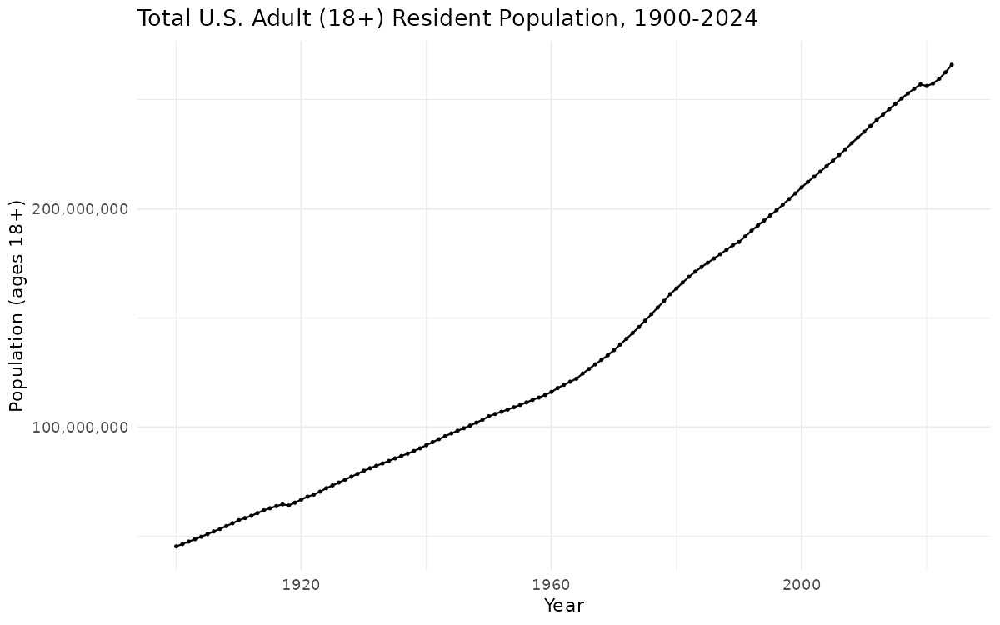
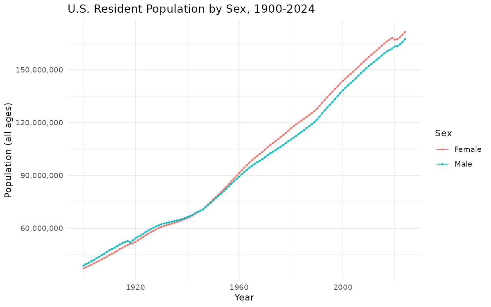
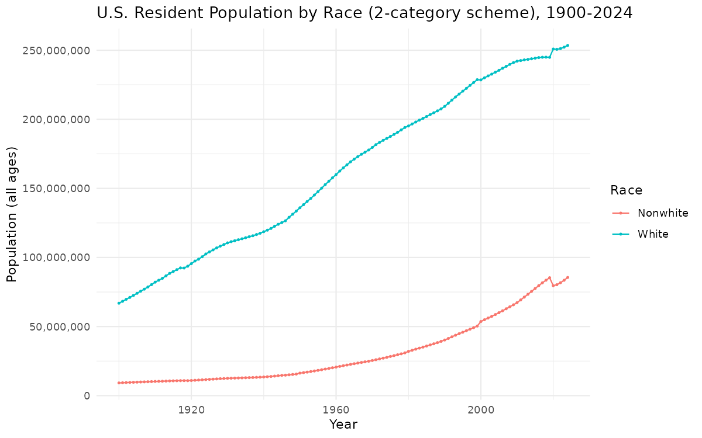
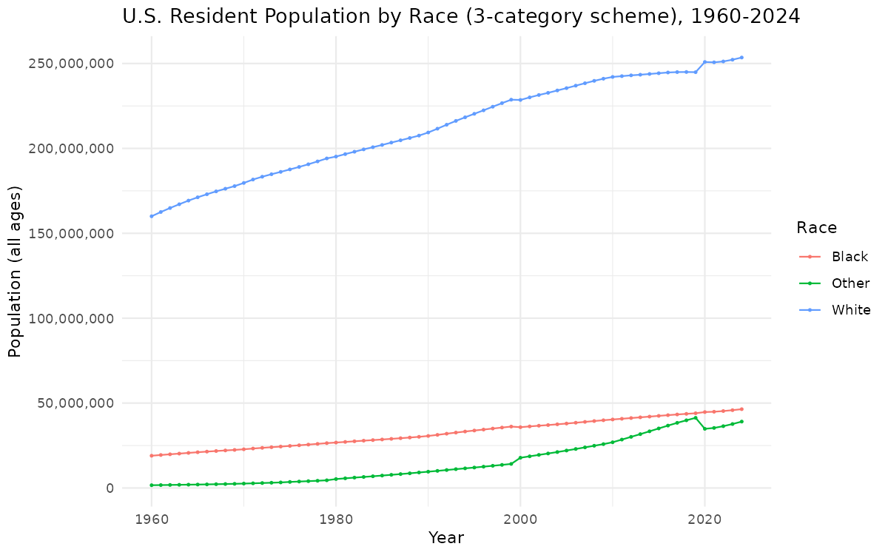
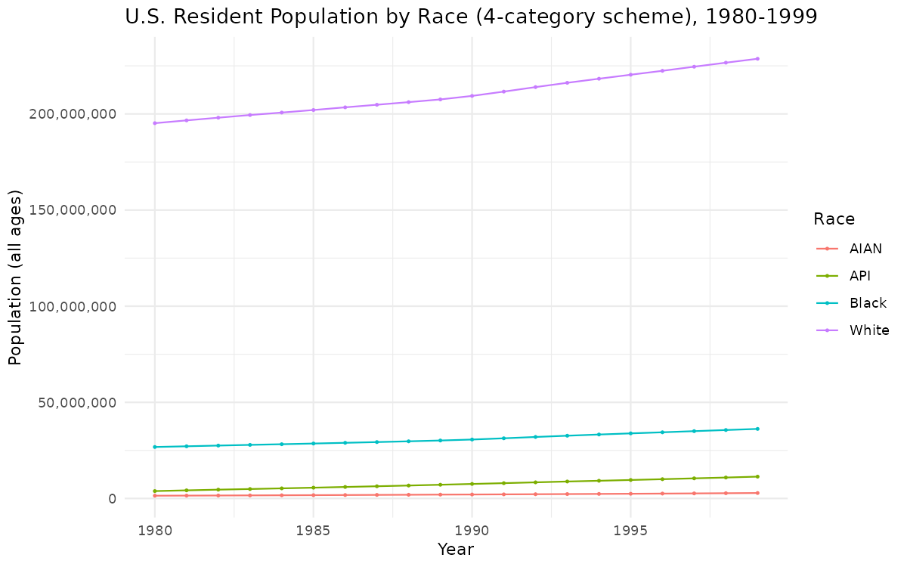
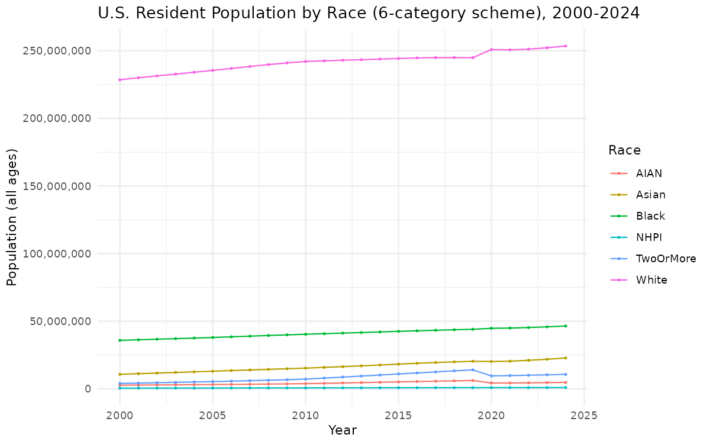
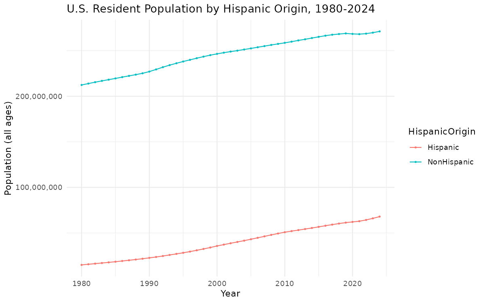
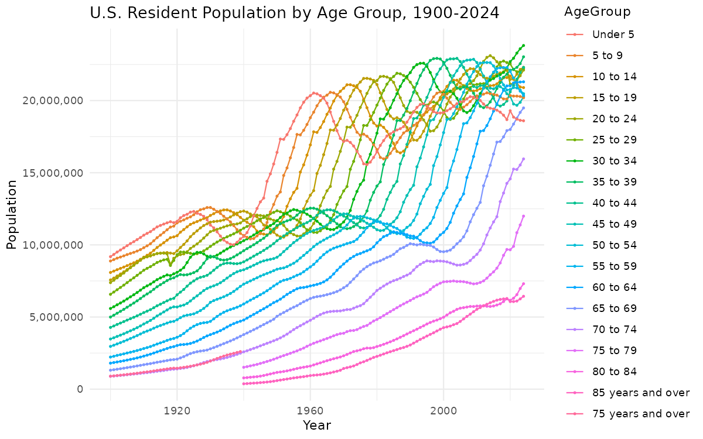

# Census PEP Population Targets, 1900-2024

- `output/census_targets_by_age.csv` -- all ages
- `output/census_targets_adults_by_age.csv` -- ages 18+

Columns: `Year, RaceScheme, Race, Sex, AgeGroup, HispanicOrigin, Population`.

## Coverage

| Variable | Value(s) | Years available |
|---|---|---|
| `Year` | 1900-2024 | 1900-2024 |
| `Sex` | Male, Female | 1900-2024 |
| `AgeGroup` | 18 five-year bins, "Under 5" - "85 years and over" (plus "75 years and over" before 1940; plus "18 to 19 years" in the adults file) | 1900-2024 |
| `Population` | -- | 1900-2024 |
| `RaceScheme` = `race2` | Race: White, Nonwhite | 1900-2024 |
| `RaceScheme` = `race3` | Race: White, Black, Other | 1960-2024 |
| `RaceScheme` = `race4` | Race: White, Black, AIAN, API | 1980-1999 |
| `RaceScheme` = `race6` | Race: White, Black, AIAN, Asian, NHPI, TwoOrMore | 2000-2024 |
| `HispanicOrigin` = `NA` | (no Hispanic-origin breakdown in the source) | 1900-1979 |
| `HispanicOrigin` = `Hispanic` / `NonHispanic` | crossed with Race | 1980-2024 (within each `RaceScheme`'s own range above) |

## Trends



















## Quick start

### R

```r
library(readr)
library(dplyr)

# sum(Population), not just dropping HispanicOrigin: 1980+ cells have two
# rows (Hispanic, NonHispanic) that must be added, pre-1980 cells have one
targets <- read_csv("census_targets_adults_by_age.csv") |>
  filter(RaceScheme == "race3", Year >= 1973, Year <= 2024) |>
  group_by(Year, Race, Sex, AgeGroup) |>
  summarize(Population = sum(Population), .groups = "drop")
```

### SAS

```sas
proc import datafile="census_targets_adults_by_age.csv"
    out=targets_raw dbms=csv replace;
    getnames=yes;
run;

data targets_filtered;
    set targets_raw;
    where RaceScheme = "race3" and 1973 <= Year <= 2024;
run;

/* sum, not just dropping HispanicOrigin: 1980+ cells have two rows
   (Hispanic, NonHispanic) that must be added, pre-1980 cells have one */
proc summary data=targets_filtered nway;
    class Year Race Sex AgeGroup;
    var Population;
    output out=targets(drop=_type_ _freq_) sum=Population;
run;
```

### Stata

```stata
import delimited "census_targets_adults_by_age.csv", clear

keep if racescheme == "race3" & year >= 1973 & year <= 2024

* sum, not just dropping hispanicorigin: 1980+ cells have two rows
* (Hispanic, NonHispanic) that must be added, pre-1980 cells have one
collapse (sum) population, by(year race sex agegroup)
```

### SPSS

```spss
GET DATA /TYPE=TXT
  /FILE="census_targets_adults_by_age.csv"
  /DELCASE=LINE
  /DELIMITERS=","
  /QUALIFIER='"'
  /ARRANGEMENT=DELIMITED
  /FIRSTCASE=2
  /VARIABLES=Year F4.0 RaceScheme A10 Race A20 Sex A6 AgeGroup A20
             HispanicOrigin A11 Population F12.0.

SELECT IF (RaceScheme = "race3" AND Year >= 1973 AND Year <= 2024).

* SUM, not just dropping HispanicOrigin: 1980+ cells have two rows
* (Hispanic, NonHispanic) that must be added, pre-1980 cells have one.
AGGREGATE
  /OUTFILE=* MODE=REPLACE
  /BREAK=Year Race Sex AgeGroup
  /Population=SUM(Population).
```

## Data sources

- **1900-1979**: Census Bureau, [National Intercensal Tables:
  1900-1990](https://www.census.gov/data/tables/time-series/demo/popest/pre-1980-national.html)
  -- `pe-11-1900s.xls` through `pe-11-1970s.xls`, one decade-bundle workbook per
  decade.
- **1980-1989**: Census Bureau, [National Intercensal Datasets:
  1980-1990](https://www.census.gov/data/datasets/time-series/demo/popest/1980s-national.html)
  -- 10 quarterly `E{yy}{yy+1}RQI.TXT` files (distributed as zips), one per year-pair,
  laid out per the [file-layout
  documentation](https://www2.census.gov/programs-surveys/popest/technical-documentation/file-layouts/1980-1990/nat-detail-layout.txt).
- **1990-1999**: Census Bureau [1990-2000 intercensal county file
  directory](https://www2.census.gov/programs-surveys/popest/tables/1990-2000/intercensal/st-co/)
  -- 10 `stch-icen{year}.txt` flat files, one per year, laid out per the
  [file-layout
  documentation](https://www2.census.gov/programs-surveys/popest/technical-documentation/file-layouts/1990-2000/stch-intercensal_layout.txt)
  and coded per the [categorical variables
  page](https://www.census.gov/data/developers/data-sets/popest-popproj/popest/popest-vars/1990-2000.html).
- **2000-2009**: `censusapi` dataset [`pep/int_charagegroups`, vintage
  2000](https://www.census.gov/data/developers/data-sets/popest-popproj/popest/2000-2010.html)
  ([variables page](https://api.census.gov/data/2000/pep/int_charagegroups/variables.html)).
- **2010-2019**: Census Bureau, [National Intercensal Population by
  Characteristics: 2010-2020](https://www.census.gov/data/datasets/time-series/demo/popest/intercensal-2010-2020-national-detail.html)
  -- `nc-est2020int-asr6h.xlsx`, documented in [Methodology, Limitations and
  Applications of the 2010-2020 Intercensal Population and Housing Unit
  Estimates](https://www.census.gov/newsroom/blogs/research-matters/2024/11/2010-2020-intercensal-population-and-housing-unit-estimates.html).
- **2020-2024**: Census Bureau, [National Population by Characteristics:
  2020-2025](https://www.census.gov/data/datasets/time-series/demo/popest/2020s-national-detail.html)
  -- `nc-est2024-alldata-c-file{02,04,06,08,10}.csv`, from the [Vintage 2024
  datasets directory](https://www2.census.gov/programs-surveys/popest/datasets/2020-2024/national/asrh/),
  documented in the [`NC-EST2024-ALLDATA` file-layout
  PDF](https://www2.census.gov/programs-surveys/popest/technical-documentation/file-layouts/2020-2024/NC-EST2024-ALLDATA.pdf).

## Irregularities smoothed over

- **1990-1999 national totals are summed up from county-level detail.** The source
  for this decade is published at the county level (roughly 95,000 rows per year);
  there is no ready-made national total to read directly, so this pipeline sums
  county x age-group x race-sex x ethnicity cells up to national totals itself.
- **Four different race classification schemes had to be assembled** because no
  single scheme spans 1900-2024 -- see "Coverage" above.
- **The 18-19 age split is interpolated, not exact, for 1990-1999 and 2000-2019.**
  Neither product has single-year-of-age detail or a pre-built 18+ aggregate that
  lines up with a 5-year age bin, so the "18 to 19 years" residual bin in the adults
  file is estimated as 2/5 of the "15 to 19" bin, assuming a uniform within-bin age
  distribution. This is the only approximate figure anywhere in either file; every
  other total is exact.
- **The 1980s and 1990s sources' "AIAE" category is relabeled "AIAN"** for
  consistency with the label used from 2000 on. Both refer to the same American
  Indian/Alaska Native population; only the source's own abbreviation differs.
- **The 2020-2024 monthly files are restricted to July estimates only**, to line up
  with every other era's July 1 reference date (the source publishes 12 monthly
  files per vintage; only the July file is used).
- **The 1980s RQI files are distributed as zip archives**, each containing one
  fixed-width `.TXT` file; the pipeline downloads and extracts them automatically.

## Discontinuities in the underlying data

- **1939/1940**: the open-ended top age bin widens from "75 years and over" to "85
  years and over."
- **1949/1950**: Alaska and Hawaii enter the geographic universe (both were still
  territories before 1950). This is a genuine change in the underlying population
  base, not corrected for here -- there is no way to retroactively add Alaska/Hawaii
  population to the pre-1950 estimates.
- **1959/1960**: the race scheme changes from two categories (White/Nonwhite) to
  three (White/Black/Other), matching the scheme used through 2024.
- **Hispanic origin has no data at all before 1980.** No source before the 1980s RQI
  files carries a Hispanic-origin breakdown.
- **"Two or More Races" has no equivalent before 2000.** The Census 2000
  questionnaire was the first to allow respondents to select more than one race; no
  earlier product has a comparable category.
- **The 2019/2020 boundary reflects a small (under 0.3%, adults-only) difference**
  between the 2010-2020 intercensal product and the 2020s "blended base" methodology
  introduced for the 2020 Census, not a real population discontinuity.

## Variable and level reference

- **`Year`**: the July 1 reference year of the population estimate.
- **`RaceScheme`**: which of the four race classification schemes (see "Coverage"
  above) the row's `Race` value is drawn from. Always filter to one `RaceScheme`
  before summing `Population`.
- **`Race`**: the category value within the row's `RaceScheme`.
  - `AIAN`: American Indian and Alaska Native.
  - `API`: Asian and Pacific Islander, the combined category used by the `race4`
    scheme (1980-1999), before the Census Bureau split it into `Asian` and `NHPI`.
  - `NHPI`: Native Hawaiian and Pacific Islander, the `race6` scheme's (2000-2024)
    split-out counterpart to part of `API`. `API` and `NHPI` are not the same
    category and do not span the same years.
  - `TwoOrMore`: Two or More Races (see "Discontinuities" above).
  - `Nonwhite`: everyone not classified White, in the `race2` scheme. An
    undifferentiated residual with no internal breakdown available in the source.
  - `Other`: everyone not classified White or Black, in the `race3` scheme. Also a
    residual, and not equivalent to `Nonwhite` -- `race3` only exists from 1960 on,
    while `race2`'s `Nonwhite` spans 1900-2024.
- **`Sex`**: `Male` or `Female`.
- **`AgeGroup`**: eighteen 5-year bins, `"Under 5"` through `"85 years and over"`,
  plus a `"75 years and over"` catch-all used only before 1940 (see "Discontinuities"
  above). The adults file additionally has a residual `"18 to 19 years"` bin in place
  of `"15 to 19"`, since Census's own 5-year bin straddles the 18+ adult/minor line.
- **`HispanicOrigin`**: `Hispanic`, `NonHispanic`, or `NA`. `NA` means no
  Hispanic-origin data exists for that row's year (always true before 1980) -- it
  does not mean "unknown" or "missing" in the usual survey-nonresponse sense.
- **`Population`**: the estimated civilian resident population for that cell.

## Documentation

- [1980-1990 national file-layout
  documentation](https://www2.census.gov/programs-surveys/popest/technical-documentation/file-layouts/1980-1990/nat-detail-layout.txt)
- [1990-2000 intercensal file-layout
  documentation](https://www2.census.gov/programs-surveys/popest/technical-documentation/file-layouts/1990-2000/stch-intercensal_layout.txt)
  and [Population Estimates Categorical Variables,
  1990-2000](https://www.census.gov/data/developers/data-sets/popest-popproj/popest/popest-vars/1990-2000.html)
- [`pep/int_charagegroups` variables
  page](https://api.census.gov/data/2000/pep/int_charagegroups/variables.html)
- [Methodology, Limitations and Applications of the 2010-2020 Intercensal
  Population and Housing Unit
  Estimates](https://www.census.gov/newsroom/blogs/research-matters/2024/11/2010-2020-intercensal-population-and-housing-unit-estimates.html)
- [`NC-EST2024-ALLDATA` file-layout
  documentation](https://www2.census.gov/programs-surveys/popest/technical-documentation/file-layouts/2020-2024/NC-EST2024-ALLDATA.pdf)

## Rendering

```r
# CENSUS_KEY must be set (e.g. in .Renviron) -- get a free key at
# https://api.census.gov/data/key_signup.html
rmarkdown::render("census_targets.Rmd")
```

## License

CC BY 4.0. See `LICENSE`.
